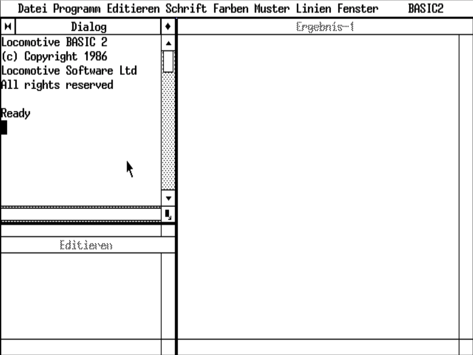

[Introduction](01.html) | [Top](index.html) | [Starting with programming](03.html)

# Early days in computing #

My first computer was one that I have bought at the start of my education. It was an IBM PC compatible computer having only 512 KB of RAM - at that time well enough RAM. It was MS DOS and GEM only at that days. While in my education I grabbed every book I could and read through it learning the ins and outs of computers.
I learned programming with Basic (really at my aunt’s C64 home computer and I realized very early at my education that there are better languages than Basic. Thus I have never done anything with my Schneider PC (GEM Basic2 from Locomotive Software).

This is the Basic2 programming environment on my Schneider PC 512

[Introduction](01.html) | [Top](index.html) | [Starting with programming](03.html)

