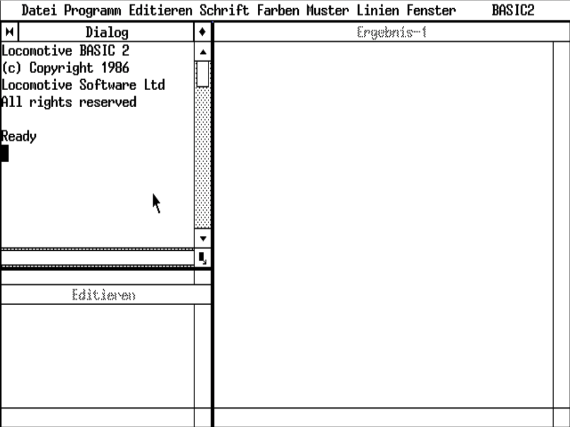

# Introduction #

<!--TOC-->

This document aims to explain how I came to writing an open source software. The reasons are multitude and very interesting. It is a non technical document about my history.

I will extend this document from time to time and fill it up with my history.

Lothar Behrens - Saturday, 27.09.2024

----

# Early days in computing #

My first computer was one that I have bought at the start of my education. It was an IBM PC compatible computer having only 512 KB of RAM - at that time well enough RAM. It was MS DOS and GEM only at that days. While in my education I grabbed every book I could and read through it learning the ins and outs of computers.

I learned programming with Basic (really at my aunt’s C64 home computer and I realized very early at my education that there are better languages than Basic. Thus I have never done anything with my Schneider PC Basic2 (Locomotive Software).

This is the Basic2 programming environment on my Schneider PC 1512 within GEM

----

# Starting with programming #

As I told, I had purchased my first computer at or short before my education, I quickly stumbled upon an object oriented language. It appealed me more than Basic and I did my next purchase. In my education, Basic was the language we learned and I was most of the time ready before the rest. That was probably because I learned Basic on the C64 and it was similar to GWBasic I think it was.

----

# My first software ideas #

As soon as I had Turbo Pascal I also had my first ideas for a software. While my education, I had collected many diskettes and it seemed to be complicated to keep notes on paper or only on the stickers to know, what is on these diskettes.

I started to write ‚dateiver‘ - a disk cataloging system. It had only a command line UI. Even today there exists many command line tools and on Linux there are many that also work together and are very helpful. But my application was a standalone application not designed to work with other applications together.

![][Dateiver]
Dateiver console application within Turbo Pascal 6.0

As you may notice, the folder is named differently. At that time I didn’t structure my source code well and that leads to struggle as well.

At that time I also learned much about programming data structures and I needed them in my disk cataloging system. Also I learned how to store and load the collected data and also to traverse a file system to read in the data from a disk. All that was before knowing something about databases.

----

# A first attempt for a customer #

After my education my first customer came to appear by contacts asking me if I could do what the customer wants to do. I contacted the customer and negotiated what the software should do and what I could start with as a first attempt.

After a.while of work I have presented the first solution. The customer was not satisfied about the software I had presented. I was a bloody beginner and failed…

----

# The professionals use SAA #

Later, when I tried to market that software as a shareware version, I got told that this application would not win a price. It was lacking a modern UI and thus the software dealer I contacted, was not appealed about it to put that in his store.

I had to buy another compiler version and needed to migrate my software from Turbo Pascal 5.5 to 6.0 to be able to utilize that new fancy SAA UI toolkit.

----

# My first model driven ideas #

After learning SAA and modern UI in that days, I learned to know a dialog designer from a book. It should help me in software creation. Quickly I found that I would do more like that and created my own first way to produce software without typing code.

![][TVBuild]
TVBuild - an attempt to produce code by an application that offers me menus and dialogs.

----

[Dateiver]: Dateiver.png

[TVBuild]: TVBuild.png